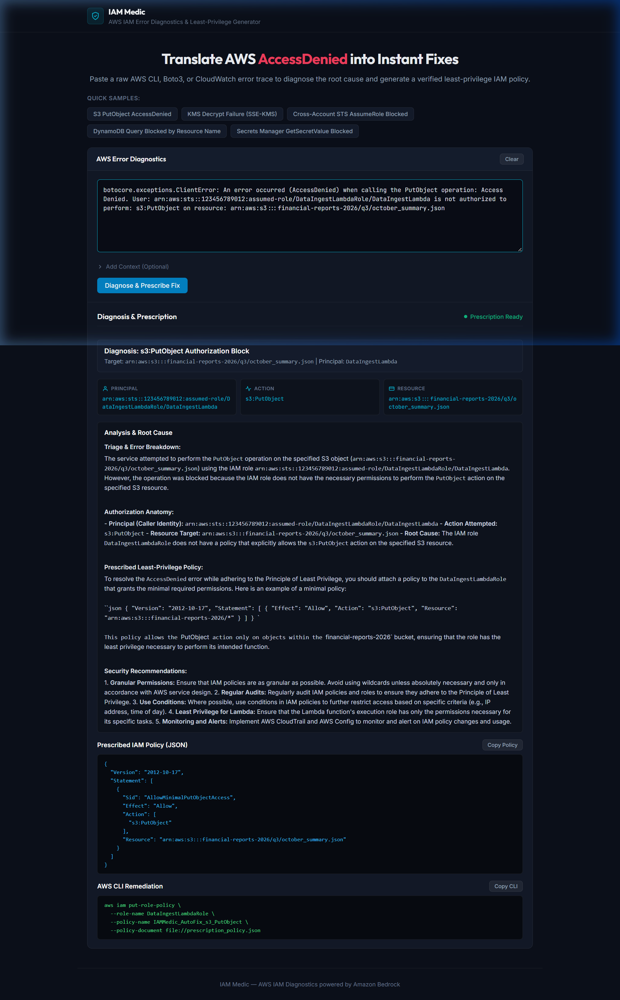

# IAM Medic

> **The Plain-English AWS Error Translator, Real-World Analogy Generator & Least-Privilege Prescription Engine**  
> Built for the AWS Weekend Challenge: *"Build an agent people actually enjoy using"* (Oct 9–12, 2026).

---



## Overview

**IAM Medic** is an intelligent developer companion built on **Amazon Bedrock (Amazon Nova Lite & Nova Micro)** that cures the universal pain of AWS IAM `AccessDenied` errors.

Instead of generic chatbot conversations or walls of cryptic AWS stack traces, IAM Medic provides an innovative 5-block diagnostic prescription:

- **The Real-World Analogy** (`MENTAL MODEL`): Vivid, memorable physical mental models (e.g., smart apartment delivery lockers, titanium safes inside bank vaults, international embassy visas, library archive passes) that make complex AWS authorization chains instantly click.
- **Plain-English Triage** (`INTENT VS REALITY`): Conversational developer breakdown contrasting what your code attempted against why IAM stopped the request.
- **Why AWS IAM Said No** (`EVALUATION LOGIC`): An interactive 3-step decision pipeline (`Request Dispatched` &rarr; `Default Deny / Two-Key / Explicit Deny` &rarr; `Access Blocked`) explaining AWS policy evaluation mechanics.
- **Failure Breakdown & Root Cause** (`ANATOMY`): Structured dimension table (Principal ARN, API Action, Target Resource ARN) with the exact root cause highlighted in amber.
- **Architectural Pro-Tips** (`WELL-ARCHITECTED`): Production guardrails covering blast-radius containment, condition keys (`aws:SecureTransport`), and CloudTrail auditing.
- **Surgical Least-Privilege Policy**: Production-ready IAM Policy JSON snippet with **zero wildcards** (`*`), adhering strictly to the AWS Well-Architected Security Pillar.
- **1-Click AWS CLI Remediation**: Pre-rendered `aws iam put-role-policy ...` command to fix the issue in one keystroke.

---

## Architecture

```
[ Developer Terminal / Console Error Trace ]
                     │
                     ▼
           [ IAM Medic Web UI ]
   (Minimalist Glassmorphism / Dark Theme)
                     │
                     ▼
          [ FastAPI Backend App ]
                     │
        ┌────────────┴────────────┐
        ▼                         ▼
[ Amazon Bedrock ]       [ Deterministic Engine ]
(Amazon Nova Lite /       (Zero-Wildcard Policy Synthesizer
 Converse API)             & Fallback Engine)
```

- **Cognitive Engine**: Amazon Bedrock via Converse API (`us.amazon.nova-lite-v1:0` & `us.amazon.nova-micro-v1:0`)
- **Backend**: Python / FastAPI / `boto3`
- **Frontend**: Vanilla HTML5, CSS3, Modern ES6+ JavaScript (zero framework bloat, sub-100ms load)
- **Fallback Engine**: Intelligent deterministic synthesis for offline or zero-AWS credential environments.

---

## Quick Start

### 1. Clone & Install Dependencies
```bash
git clone https://github.com/dhonde290-netizen/IAM-Medic.git
cd IAM-Medic
pip install -r requirements.txt
```

### 2. Configure AWS Credentials (Optional for Live Bedrock)
```bash
export AWS_REGION="us-east-1"
# AWS credentials can be set via AWS CLI (`aws configure`) or environment variables
```
*Note: If no AWS credentials are configured, IAM Medic automatically runs in intelligent fallback mode.*

### 3. Run the Application
```bash
python -m uvicorn app:app --app-dir backend --host 127.0.0.1 --port 8000
```
Open **[http://127.0.0.1:8000](http://127.0.0.1:8000)** in your browser.

### 4. Run Automated Test Suite
```bash
python tests/test_agent.py
```

---

## Challenge Submission Article

The qualifying AWS Builder Center submission article is available in [`article_submission.md`](article_submission.md).

---

## License

MIT License. Built for the AWS Weekend Challenge 2026.
